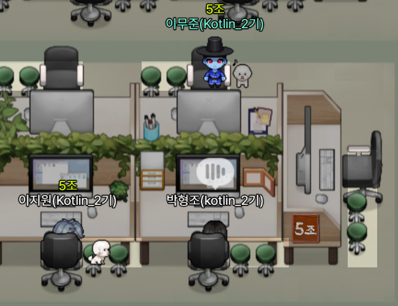
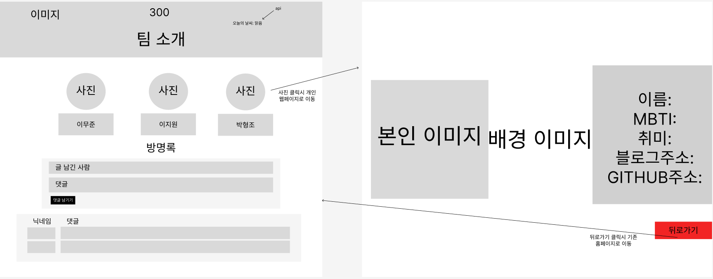

# PROJECT 300

### 팀원

|이름|태그|MBTI|블로그|GitHub|한마디!|
|------|---|---|---|---|---|
|박형조|<code>팀장</code>|INTP|[바로가기](https://hjpkotlin2024.tistory.com/)|[바로가기](https://github.com/kotlin2024/sparta)|매일매일 발전하기|
|이무준|<code>팀원</code>|INFJ|[바로가기](https://moomoo11.tistory.com/)|[바로가기](https://github.com/Moo-moo-11)|항상 최선을 다하기|
|이지원|<code>팀원</code>|ISTP|[바로가기](https://velog.io/@vptl7211/posts)|[바로가기](https://github.com/gooddle)|끝까지 화이팅|

### 팀 소개

- 팀명 : 300
- 팀 소개 :  열정과 의지로 같이 배워나가는 팀

### 프로젝트

- 프로젝트명 :  This Is Sparta!
- 프로젝트 소개 :  팀원 3명의 짤막한 자기소개를 담은 웹페이지 제작

### 개발 일정

2024.04.15(월) 14:00 ~ 24.04.19(금) 12:00 Mini Project 제출 및 발표

### 역할 분담
    
기본적으로 역할을 나누되 서로 간에 보완할 점을 깃허브를 이용해서 완성했습니다.
    
1. 메인페이지 뼈대(html) 제작 - 정한수
2. 개인 소개 틀, 방명록 제작 - 이지원
3. 메인페이지 CSS - 이무준
4. 버튼 상호작용(스크립트) 구성 - 박형조
5. 각자 개인 소개 - 각자

### 사용하는 기술
- HTML
- CSS
- Javascript
- Git/GitHub

### 와이어프레임

